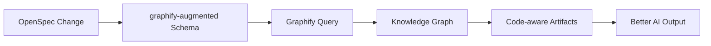

# graphify-openspec-bridge

**OpenSpec + Graphify = codebase-aware AI workflow.**

Bridge your OpenSpec change proposals with your codebase's knowledge graph. Every artifact—proposal, specs, design, tasks—is grounded in real code structure instead of guesswork.



## Features

- **Graphify-first workflow** — 5-artifact pipeline: proposal → explore → specs → design → tasks
- **Exploration step** — dedicated artifact for graphify query results before design
- **CLI diagnostics** — check runtime, dependency, and project health
- **Zero-config install** — single command copies schema + configures OpenSpec

## Install

### One-liner

```bash
npx graphify-openspec-bridge install ./my-project --with-config
```

### Global install

```bash
npm install -g graphify-openspec-bridge

# Alias: gob
gob install ./my-project --with-config
```

### Prerequisites

| Tool | Install |
|------|---------|
| [OpenSpec CLI](https://github.com/Fission-AI/OpenSpec) | `npm install -g @fission-ai/openspec` |
| [Graphify](https://github.com/safishamsi/graphify) | `pipx install graphifyy` |
| Node.js 16+ | `node --version` |

## Quick Start

```bash
# 1. Check your project is ready
gob check

# 2. Install the graphify-augmented schema
gob install --with-config

# 3. Validate
gob validate

# 4. Start a codebase-aware change
openspec new change my-feature --schema graphify-augmented

# 5. Before writing the proposal, explore your codebase
openspec new artifact explore  # runs graphify query/path/explain
```

## CLI Reference

### `check [path]`

Check runtime (Node.js), dependencies (OpenSpec, Graphify), and project state (config, schema, graph).

```bash
gob check ~/my-project
```

Output:

```
  Runtime
    ✓ Node.js v24.12.0

  Dependencies
    ✓ openspec 1.3.1
    ✓ graphify 0.8.19

  Project
    ✓ openspec/config.yaml
    ✓ openspec/schemas/graphify-augmented/  (schema.yaml + 5 templates)
    ✓ graphify-out/graph.json  (2304 nodes, 2408 edges)

Status: Ready
```

### `install [path] [--with-config]`

Copy the `graphify-augmented` schema to a project's `openspec/schemas/` directory.

| Flag | Effect |
|------|--------|
| `--with-config` | Also update `openspec/config.yaml` with graphify context + rules |

### `validate`

Run `openspec schema validate graphify-augmented` to verify the schema is correctly installed.

### `version`

Print package version.

### `help`

Show usage information.

## Schema: graphify-augmented

The schema follows this workflow:

```
proposal (why) → explore (graph) → specs (what) → design (how) → tasks (do)
```

| Artifact | Description | Graphify Usage |
|----------|-------------|----------------|
| **proposal** | Business motivation, capabilities | `graphify query <domain>` for codebase context |
| **explore** | Knowledge graph deep-dive | `query` + `path` + `explain` — maps affected areas |
| **specs** | Detailed requirements | References exploration findings |
| **design** | Technical architecture | `graphify path` to verify connections |
| **tasks** | Implementation checklist | Tasks annotated with graph node references |
| **apply** | Execute tasks | Auto-runs `graphify update .` on completion |

## Development

```bash
git clone https://github.com/klc/graphify-openspec-bridge
cd graphify-openspec-bridge
npm link
gob check
```

## Related

- [OpenSpec](https://github.com/Fission-AI/OpenSpec) — AI-native spec-driven development
- [Graphify](https://github.com/safishamsi/graphify) — turn any folder into a queryable knowledge graph

## License

MIT
